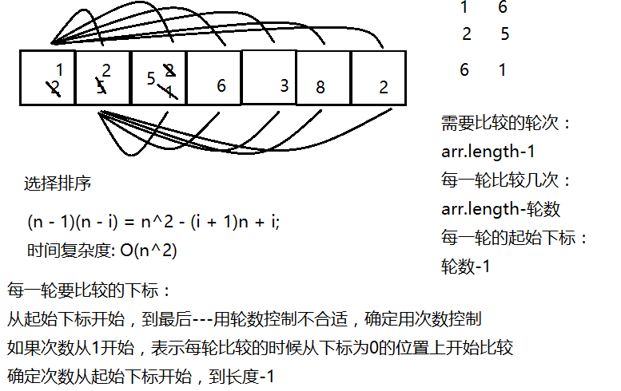
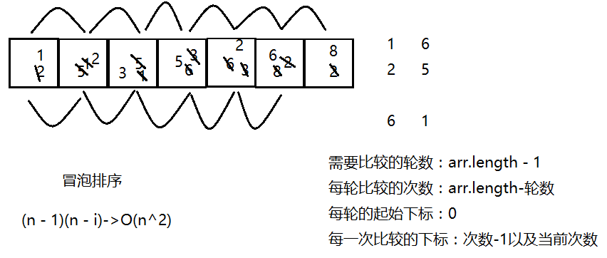
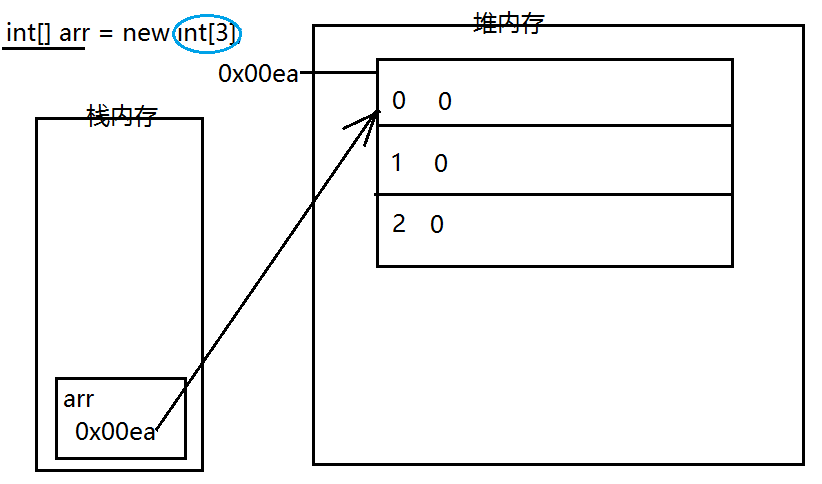
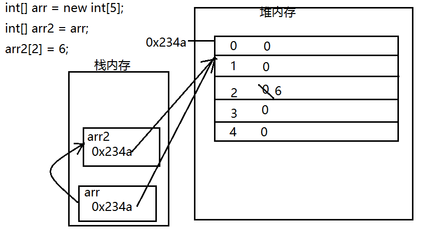
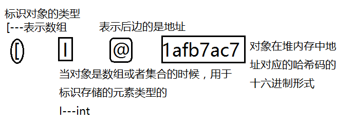
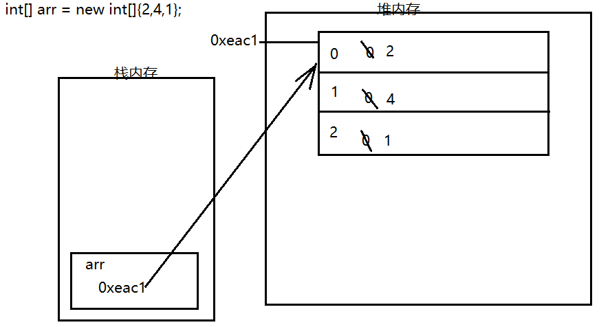
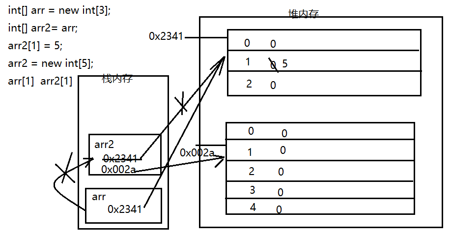

#### 数组定义

  用于存储哟一组同一数据类型的容器。长度固定。数组会对放入其中的数据自动编号，编号是从0开始的---下标

#### 定义格式

**数据类型[] 数组名 =new 数据类型[数组的大小];**  可以先申明再初始化。例如：

```java
int[] arr=new int[5]; //定义一个最多存储5的整数的数组
arr[3]=4;
```

 arr[3]  - 通过数组名[下标]的形式来获取数组元素或者给对应的值、位置赋值

**数据类型[] 数组名=new 数组类型[]{元素1，元素2，......}; ** 可以先申明再初始化。例如：

```java
int[] arr=new int[]{1,2,3}//在定义好数组中的初始元素的同时定义好了数组的大小，不能在改变大小
```

**数据类型[] 数组名={元素1，元素2，.....}; ** 不可以先申明再初始化，没有办法获取元素的个数。例如：

```java
int[] arr = {2,5,3,6,1,8,9}; 
```

#### 数组的应用

1. **获取数组元素** ：`数组名[下标`   例如： arr[2]。

2. **获取数组的长度**：`数组名.length`（int length=arr.length)。例如：arr.length。

3. **遍历数组** （就是把每一个元素都看一遍）: 通过获取对应下标来获取对应位置上的元素。时间复杂度O(n)

​         for( int i=0;i<arr.lenth;i++ ){ System.out.println(arr[i]; }：这种可以对原来的数进行操作。

​        for( int i:arr){ i+=1;System.out.println(i); }：这个时候数组的遍历是在原来的基础上加1的遍历。这种不能对原来的数进行操作

> for(int i : arr){...}：`增强for循环`。把数组中的每个元素作为单独的变量来使用

   看一下这组数组中有什么，不用操作这组数组: String s=**Arrays.toString(arr)**；例如：

```
String s=Arrays.toString(arr)；
System.out.println(s);
```

4. **数组元素排序**



 **选择排序：是先将最小的数排到第一个位置。**

```java
int [] arr={2,3,4,7,1};
for (int i=1;i<arr.length;i++){
   for(int j=i-1;j<arr.length;j++){
      if(arr[i-1]>arr[j]){       //也有一次自身的比较
          int temp=arr[i-1];
           arr[i-1]=arr[j];
           arr[j]=temp;
          }
        }
     }
   String s=Arrays.toString(arr);
   System.out.println(s);
```



**冒泡排序：先将最大的排到最后一个位置。**

```java
int [] arr={2,3,4,7,1};
for (int i=1;i<arr.length;i++){
  for(int j=1;j<=arr.length-i;j++){   
    if(arr[j-1]>arr[j]){       //并没有用到i，同时再比较时，多了一次自身的比较
      arr[j-1]^=arr[j];
      arr[j]^=arr[j-1];
      arr[j-1]^=arr[j]；
      }
    }
  }
String s=Arrays.toString(arr);
System.out.println(s);
```

**Arrays.sort(arr);**   会自动对数组排序，`默认是升序排列`。

5. **获取数组元素的最值 - 遍历**

 **最大值（记录最大值)**：  例如： int [] arr={2,3,4,7,1};

```java
int max=arr[0];
for(int i=1;i<arr.length;i++){
   if(max<arr[i]){
      max=arr[i];  
      }
   }
System.out.println(max);
```

**最大值（获取最大值的下标）**：例如：int [] arr={2,3,4,7,1};

```java
int max=0;
for(int i=1;i<arr.length;i++){
  if(arr[max]<arr[i]){
     max=i;
   }
}
System.out.println(arr[max]);
```

6. **获取元素的位置** 

​      方法两种：遍历；

​                    **折半查找（二分查找**这种查找只能在排序好（从小到大）的数组中进行查找，如果数组是乱序的不能使用。

方法一： 举例：int [] arr={1,2,3,4,5};

```java
int i=3;
int min=0;
int max=arr.length-1;
int mid =(max+min)/2;
while(min<=max){
    if(arr[mid]==i){  
        System.out.println(mid);
        break;
   }else if(i>arr[mid]){
        min=mid+1;
   }else{
        max=mid-1;
    }   
        mid=(max+min)/2;
 }
```

方法二： 举例：int [] arr={1,2,3,4,5};   

```Java
int i=3;
int min=0;
int max=arr.length-1;
int mid =(max+min)/2;
while(arr[mid]!=i){
   if(i>arr[mid]){
         min=mid+1;
    }else{
         max=mid-1;
   }
   if(min>max){
          break;
    }
     mid=(min+max)/2;
  }
System.out.println(mid);
```

7. **数组的反转**。例子：int [] arr={1,2,3,4,5};

```java
for(int start=0,end=arr.length-1;start<end;start++,end--){
      int temp=arr[start];
      arr[start]=arr[end];
      arr[end]=temp;
 }
   String s=Arrays.toString(arr);
    System.out.println(s);
```

8. **数组的扩充 - 数组的复制**

**`System.arraycopy(源数组,源数组中的起始下标,目标数组,存放的起始下标,复制的元素的个数);`**

**`源数组 = Arrays.copyOf(源数组，扩容之后的长度);`**

例如： int[] arr = {1,2,4,6,1};     int[] arr2 = new int[8];

```java
arr = Arrays.copyOf(arr,2);
int[] arr2 = new int[2];
if(扩容之后的长度 < arr.length){
     System.arraycopy(arr,0,arr2,0,扩容之后的长度)
} else {
     System.arrayco.py(arr,0,arr2,0,arr.length)
}
arr = arr2;
```

**注意**：如果下标超过范围，编译无错，运行时会出现ArrayIndexOutOfBoundsException -`下标越界异常`

#### 内存

  栈内存,，堆内存，方法区，本地方法栈，寄存器 - ava在运行时所占的内存

##### 栈内存

   可以用于存储变量，栈内存对存入其中的变量不会自动赋值，变量在使用完成之后会立即移出栈内存释放空间

##### 堆内存

​    用于存储对象的，堆内存对于存入其中的元素会自动的赋予`初始值 - byte/short/int-0,long-0L;float-0.0f,double-0.0,char- ‘\u0000’,boolean-false,引用数据类型的默认值都是null`，对象使用完成之后不会立即移出堆内存，而是在不定的某个时刻被回收












 


 