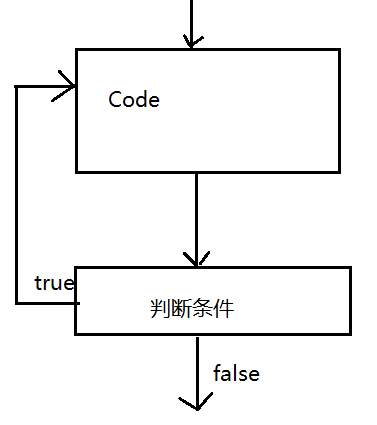

#### 一. 顺序结构     

  指程序从上到下从左到右依次运行

#### 二. 分支结构

##### 1.判断结构

> if( 逻辑值 ){ 代码块; }
>
> if( 逻辑值 ){ Code1; } else { Code2; }
>
> if( 逻辑值1 ){ Code1; } else if( 逻辑值2 ) { Code2; } else { Code3; }

如果代码块`只有一句`，此时{}可以`省略`不写

##### 2.选择结构

​    表达式的类型是`byte/short/int/char`, JDK1.5之后允许使用`枚举常量`， JDK1.7之后允许使用`String`。 case,使用String的时候，在同等条件下，效率比if  else if低。

`Break`表示`终止当前的选择`。如果每个case之后都有一个break，那么这个时候case之间的顺序没有影响。

```java
int i =0;
switch(i) {
  case 0: int j=0;
  case 1: j+=1;
  case 2: j+=2;
  default: System.out.println(j);
}
```

   编译报错，没有初始化，因为如果i=1的话，那么不会走case0；因此，j没有初始化。

```java
switch(表达式){           
  case 情况1 : Code1;break;
  case 情况2 : Code2;break;
   ……
   default:Code;break;
} 
```

`break`表示当前一层选择语句的结束

 当控制输入字符串的东西的时候，设置参数时，用String。即：String c=a.next();

##### 3.循环结构

（要想结束语句。那么需要有自增或自减来控制循环结束。i++；i--,是写在语句块中且在输出语句之后（System.out.println））。如果是每一次自增或自减都要显示出来。那么输出语句放到while的大括号之内；如果只是显示结果（如某某的求和），那么输出语句放到之外。求和不仅可以通过自增来实现，还可以通过自减来实现，同时，在自减求和过程中不需要设置初始参数（即int i=1））

> while( 逻辑值 ){ Code; }

在求和或者其他什么的时候，必须先要设置类型及变量初始化，即int i=1；int sum=0；

在求出结果是字符串拼接的时候（如十进制转二进制），要设置字符串的变量(即String str="";）

（十进制转二进制：String str="";while(a!=0){str=str+a%2; a/=2;)

> do{ Code;  } while( 逻辑值 );-------->while(a>x);

它的循环过程如下：

 

> for( 定义循环变量; 控制判断条件; 改变循环变量 ){ 代码块; }

在这个循环中，括号里的可以提到外部去，但是里面的分号不能省略。例如：

​    for (int i=d;i<=b;i+=d){ ... }  =>  int i=d; for (;i<=b;) {i+=d; ...}   当把控制判断条件省略时，就是死循环了。

**for循环的循环变量在循环结束之后不可使用，while循环可以**

**当循环的次数固定或者步长固定建议使用for循环**

**当循环次数不定或者变化不规律的时候建议使用while**

**嵌套：打印星星**

整列打印：

```java
for(int i=1;i<=row;i++){
    for(int j=1;j<=i;j++){
          System.out.print(" *");    
         }
        System.out.println();
}
```

反列打印：

```java
int row=a.nextInt();
for(int i=row;i>=1;i--){
    for(int j=i;j>=1;j--){
         System.out.print(" *");    
       }
       System.out.println();
}
```

**九九乘法表打印**

   **+"\t"表示加空格**

```
for(int i=1;i<=9;i++){
   for(int j=1;j<=i;j++){
       System.out.print(i+"*"+j+"="+j*j+"\t"); 
      }
      System.out.println();
}
```

##### Break与continue

`Break表示终止当前一层循环或者一层选择；Continue表示跳出当前一层循环`

 