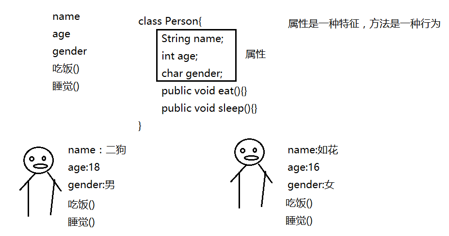

#### 函数/方法定义

  对一段功能或者逻辑进行封装，这种封装的体现形式就是函数。是为了方便重复使用这段功能**。**

#### 函数/方法定义格式

> 修饰符  返回值类型  函数名(参数列表) {
>
> ​    方法体（函数体）；
>
> ​    return 返回值;
>
> }


说明： 

1. 明确这个函数执行完成之后返回值的类型。例如：求两个整数的和，返回值类型一定是int类型。当函数没有返回值的时候，返回值类型定义成void。（可以用return；来写）

2. 明确函数在执行过程中是否有未知的量参与运算。例如：求两个整数的和，这两个整数函数中不存在，这时候就要以参数的形式体现。参数本质上就是一个`变量`。

3. 在声明函数的时候所写的参数，称之为形参。

```java
public static int add(int i, int j){
        int sum = i + j;
        //当函数执行到return的时候，函数执行结束
         return sum ;
}
```

4. 在调用函数的时候传入的参数称之为实参。例如：add(2,5);

 注意：一个函数的返回值类型即使是void，也可以写return语句。 

注意：

1. 如果函数没有返回值，那么返回值类型定义为void。

2. return后续的代码不再执行。

3. 任何一个实体函数都有return语句。

#### 重载定义

 一个类中存在了`函数名一致`，而`参数列表不一致`的函数的时候，称这多个函数之间构成了重载。

**方法重载注意事项:**

1. 方法名相同。

2. 方法的参数类型，个数，顺序至少有一项不同

3. 方法的修饰符可以不同

4. 方法的返回类型可以不同

另外：

5. 只是返回类型不一样并不构成重载

6. 只是控制访问修饰符不一样不构成重载

**约瑟夫问题（丢手帕问题)**

1. 方法覆盖的：子类有一个方法和父类的某个方法名称、返回类型、参数一样

2. 方法覆盖注意：

​         子类的方法的返回类型、参数、方法名称要和父类的一样，否则编译出错

​         子类方法不能缩小父类方法的访问权限，但是扩大是可以的

**函数在调用方法的时候，没有最匹配的时候，他就会去`找相对匹配度更精确`的**。

  举例：有两个方法：add（int i，int j，int k），add（double i，double j），那么要求add（3,5）的结果所调用的方法只能选第二个，结果为：8.0

**方法名+参数列表  == 方法签名**

注意：在进行方法的重载的时候，需要把所有的情况尽可能的重载一遍，以防出现  

#### 递归

```java
public static int sum(int number){
          if(number == 1){
                 return 1;
           }
      //在函数中调用自己本身的情况称之为函数的递归
        return number + sum(--number);
 }
```

​      递归的代码的简洁度上比循环要好一些，但是不容易理解。`减少使用递归`。递归次数过多的时候，会出现**StackOverFlowError(栈溢出错误)**。方法是在栈内存中执行的。

#### 函数的优点

1. 提高了代码的复用性

2. 使代码更加规范化、结构化

3. 便于模块化开发

#### 面向对象

 定义：面向对象是**相对于面向过程**而言的。**面向过程注重的执行的动作/完成的过程**，强调的是**执行的过程**；**面向对象注重的是对象**，只要找到了对应的对象，就自然的获取到了该对象身上的所有功能/方法。面向对象是基于面向过程的。


面向对象一定优于面向过程吗？

   不一定。对于**相对简单**的事物，**面向过程**效率比较高；对于一些 **复杂的事物**而言，面向**对象**更简便。

#### 类和对象的关系



   对一类事物（对象）进行抽取，将特征抽取成属性，将行为抽取成方法，就产生了代表这一类事物的类。**类是对象的概括**，

通过new关键字来创建具体的对象/实例。**对象是类的实例/具体**。

Person p = new Person(); 创建了一个具体的人对象。


```java
p.name = “二狗”;
p.age = 18;
p.gender = ‘男’;
p.eat();//调用p对象身上的eat方法
```

注意：**Java中所有的非静态属性和非静态方法都是通过对象来调用的**


**在传递参数的时候，基本数据类型传递的是实际的数值 ；对于引用数据类型而言，传递的是地址**


​    要**创建对象**，就要写一个类，类中是**没有参数列表**的，且不是公共类不用public修饰，即：class PERSON{}   在这个类中，有属性，即int age；同时有方法，即：public void eat(){},而方法要遵循函数的要求，且一般要用public修饰。

#### 匿名对象

定义： **只使用一次，没有对象名**，能调用方法，可以作为参数传递。在创建对象的时候，这个**对象没有名字**。

例如：new Person();  创建了对象，但是在栈内存中没有对应的引用

说明：

1. 匿名对象能不能调用方法？ 能，例如：new Person().eat();

2. 匿名对象在其定义的函数内只能使用一次，使用完成之后，**不一定会立即移除出堆内存，在不定时的某个时刻被回收**。

3. 当某个方法只需要使用一次的时候，可以使用匿名对象；还可以作为参数进行传递。在被传入的方法中，匿名对象在栈内存中就存在了引用。

```java
ChangeOf(new Person()); 
Public static void ChangeOf(Person p){ p=new Person;}
```

只要栈内存中存在了指向堆内存中的对应的引用，那么堆内存中对应的对象就不能被释放。

#### 成员变量和局部变量比较

**定义位置不同**：成员变量是定义在类内代码块外的变量；局部变量是定义在代码块或者语句内部的变量。

**作用域不同**：成员变量定义在整个类中。局部变量只能作用在当前定义的代码块或语句中。

**内存位置不同**：成员变量存储在堆中，并赋予初始值；而局部变量存储在栈中，不会赋予初始值。

**生命周期不同**：成员变量是存储在堆中，对象被创建时产生，对被回收时释放；局部变量在代码块或语句执行时产生，执行完之后立即释放。

#### 局部代码块

位置定义：在**方法或者语句内部用{}包括起来的代码**称之为局部代码块

**作用： 限制变量的生命周期，提高内存的利用率**。

```java
int i = 0;
//while(true);//编译完成之后立即确定这是一个死循环，确定后续的代码执行不到，那么此时，后续代码对于程序来说就是废话，那么这时候编译会立即报错
while(i < 10);//编译的时候，认为后续代码可能会改变这个循环变量的值，JVM就认为这个循环有结束的可能
{
   i++;
 }
System.out.println(i);                                                                                                                                   
```

#### 补充

```Java
int i = 5;
if(i = 6); //i = 6是一个赋值语句，需要的是一个判断条件，所以编译报错

boolean b = true; 
if(b = false); //可以，虽然b = false是一个赋值语句，但是赋值之后b的值是以逻辑值，符合判断条件的需要

boolean b = true;
b == false;// false

b= false;
b == false//true
    
boolean b = false; 
if(b == false){代码块}//结果：代码块要执行
```

