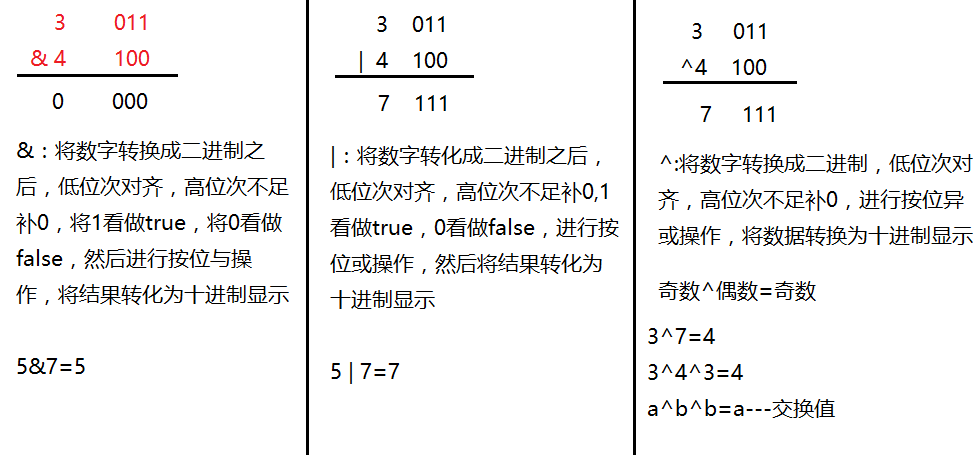
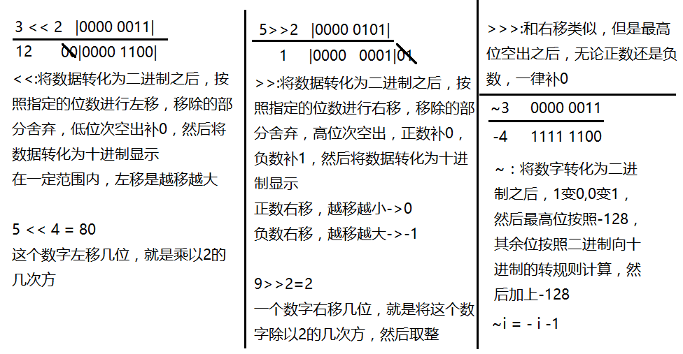

#### 编码

阿斯科玛表(`ASCII`) ，0~127，65-A  97-a  48-0

西欧码表(`ISO-8859-1`) ，0-255， 一个汉字占1个字节

`gb2312`     0-65535---gbk，  一个汉字占2个字节

Unicode编码体系(`utf-8`)， 一个汉字占3个字节

计算机中存储单位：bit位 Byte字节  1Byte=8bit  1KB=1024B MB GB TB PB YB

#### 常量

 定义：直接量，放到常量池中。

 `整数常量` - 所有的整数。例如：3,100

`小数常量` - 所有的小数。例如：3.5,6.9

`字符常量 ` - 有单引号将一个字母或数字或符号标识起来    例如：‘a’  ‘+’  ‘=’

`字符串常量`- 用双引号将一个或者多个字符标识起来       例如：“abc” “124” “s12”

`布尔常量 ` - 用于表示逻辑值。例如：ture/flase

`空常量`- 例如：null

 例子：  5-整数常量, 5.0-小数常量， ‘5’-字符常量， “5.0”-字符串常量。  ‘5.0’-错误写法

#### 转义字符

 `\t` - 制表符      `\r` - 回车   ` \n` - 换行    `\\` - 反斜杠     `\’` - 单引号     `\”` - 双引号    `\0 ` -空格                                                              

#### 进制

`二进制`： 满二进一。例如：0~1,1+1=10 100011从**JDK1.7**开始，允许以`0b`（或者`0B`)。作为此开头来标识一个数字是一个二进制数字

`八进制`：满八进一。例如：0~7,7+1=010  06  015   是否是八进制要求必须以`0`开头---无论什么版本

`十进制`：满十进一 例如：0~9，

`十六进制`：满十六进一 。 0~9和A~F（a~f大小写都可以），9+1=A，F+1=10   要求以`0x`（或者`0`X）作为开头 0x5  0xad

##### 进制的转换

十进制转换二进制：不断除以2取余，然后将余数倒排。例如6----0b110

二进制转十进制：从低位次起，按位次乘以2的位次次幂，然后求和。例如0b1101---13

二进制转换为八进制:从低位次起，每三位划分为一组，不足三位补0，产生一位八进制数字，将这些数字按序排列即可。0b11011=033

八进制转二进制：一变三。一位八进制数字产生三位二进制数字   例如：0524= 0b101010100

二进制转换成十六进制：四变一的过程。  例如: 0b1101101110  - 0x36e

#### 变量

##### 变量定义

1. 数据类型 变量名=数据。例如： int a=5；

2. 数据类型 变量名;变量名=数据。例如：int b;b=2；

```Java
int i，j=5，k； 
System ,out,println(i);
 Int i=5; //----------这样不行 ，变量必须先声明再
 Int i； System ,out,println(i);//---------不行，变量在使用之前必须初始化
```

#### 数据类型

##### 基本数据类型

###### 数值型

###### **整数型** 

`byte(字节型)`：1个字节，  -2的7次方~2的7次方-1(-128~127)。例如：byte b=5；byte b2=-128；

`short(短整型)`：个字节， -2的15次方~2的15次方(-32768~32767) 。例如：shot s=54； short e=-800；

`int(整型)`：4个字， -2的31次方~2的31次方。int j=100_000_000；从JDK1.7开始是允许的，在编译的时候会自动忽略这些_，转化为100000000。int i=00001111：八进制。Java中整数整数`默认型就是int`

`long(长整型)`：8个字节，  -2的63次方~2的63次方。-以`L`作为结尾标识这个数字是一个long类型的数字。例如：long l=3L。

浮点型

`float(单精度)`：4个字节。`必须以f为结尾`。float f=3.2f。

`double(双精度)`：8个字节。Java中`小数默认`的是`double类型`。

```java
double d=3.5；
double d=4.6D;//----可以
double d=3.9e4；//是十进制的科学计数法------39000
double d=0x3p3；//是十六进制的科学计数法---24----3*2^3=24
```

###### **字符型** 

`char`：2个字节。例如：0~65535。char c=’a’;    char c=’中’;

###### 布尔型

`boolean`：true/flase。例如： boolean a=true; 

#### 八种数据类型的默认值

| 序号 | 数据类型         | 位数 | 字节 | 默认值 | 可表示数据范围           |
| ---- | ---------------- | ---- | ---- | ------ | ------------------------ |
| 1    | Byte（位）       | 8    | 1    | 0      | -2的7次方到2的7次方减1   |
| 2    | Short（短整型）  | 16   | 2    | 0      | -2的15次方到2的15次方减1 |
| 3    | Int（整型）      | 32   | 4    | 0      | -2的31次方到2的31次方减1 |
| 4    | Long（长整型）   | 64   | 8    | 0      | -2的63次方到2的63次方减1 |
| 5    | Float（单精度）  | 32   | 4    | 0.0    |                          |
| 6    | Double（双精度） | 64   | 8    | 0.0    |                          |
| 7    | Char（字符）     | 16   | 2    | \u0000 |                          |
| 8    | Boolean（布尔）  | 8    | 1    | flase  |                          |

#### **引用数据类型**

`类class`   `接口interface `  `数组 []`

#### 数据类型转换

##### 隐式转换/自动类型转换

byte b=100；int i=b；long l=63; //可以，当整数的值在int类型的范围内是，可以不用添加L这个结尾

**规律一：小的类型可以转化为大的类型：byte->short->int->long-     float->double**

​     例如：int i=5;float f=i;long l=6;float f=l;

**规律二：整数可以转化为小数，但是可能产生精度损失**

  例如：char c=’a’;int b=c;

**规律三：字符型可以转化为整型**

```java
short s=’a’;//---可以
char c=100;//---可以
char c=’a’;
short s=c;//----不可以
```

​      定义了char类型的变量c，存储的数据是一个字符，不需要检查具体字符编码，当赋值给short类型的时候，short类型需要检查这个字符对应的编码是否在short类型的取值范围内，这个时候无法确定这个字符对应的具体编码，由于short类型的取值范围和char类型没有完全重合，为了防止出现超过范围的情况，不允许赋值。

```java
short s=97；
char c=s；//---不可以
```

**char -> int**

**byte -> short -> int -> long -> float ->double**

##### 显示转换/强制类型转换（要加符号来强转）

long l=54；int a=（byte）I；double d=3.5；int i=(int)d； 小数强转成整数的时候，小数部分直接舍弃

**double类型不能精确存储小数**。例如：double a=3-2.995；

#### 运算符

##### 算数运算符

**+加， -减 ，*乘， /除， %取模 ，++自增， --自减，  +字符串拼接**

` 开方的用法：double s=Math.sqrt(c); s*s=c`

 `N次方：int s=Math.pow(c,n); s=c^n;`

例子：int i=5210/1000*1000；i=5000；注意以下：

1. 整数运算完成之后的结果一定是整数。

```java
double d=53101.0/000*1000// ==>5310.0
double d=5310/1000*1.0*1000；//==>d=5000.0
```

2. 整数除以0的时候，编译通过，运行报错。ArimeticException ->`算术异常`

3. 小数除以0的结果是infinity

4. 0/0.0的结果是NaN。Not a Number =>非数字

```java
Integer i = new Integer(100);
Integer j = new Integer(100);
if(i >= j && j>=i && i !=j){
  Syetem.out.println("ha")
}
```

​        有结果，因为>=与<=比较的是实际值，成立，而！=比较的是地址，是不同的，成立。

5. byte/short类型在运算的时候会自动提升为int类型

​           byte b1=100+2; 可以，有一个优化过程，先自动生成102赋值给b1。  

​           byte b2=b1+2; 不可以，因为b1自动提升升为int类型，结果的b2为int类型。

​           byte b3=b1+b2; 不可以，同理，b1+b2之后提升为int类型，所有b3应该为int类型。 

###### %取余运算

  对于负数的取余，按照正数的取余运算， 取余符号左边的数字的符号，如果左边是负数，那么结果就是负数

例如：5%3=2，1%4=1，-5%3=-2，-4%3=-1，-3%7=-3，5%-3=2，7%-2=1，2%-8=2，-5%-3=-2 ，-9%-3=0，5%1.2=0.2，6%1.3=0.8，4.3%1.4=0.1 

###### ++/--

**对于++在原来的基础上自增1** 

```java
int i=5；
int j=++i;----i自增1，然后将i的值赋值给j---先自增，再运算
int j = i++;--->先获取i的值5，i自增变成6，然后将获取的值5赋值给j---先运算，再自增
int i=3；
int j = ++i * 2;-> j = 8;
int j = i++ * 2;->j = 6（int i=2；int j=++i；int a=i++；---->这里不管是哪一个，i已经是3；而j=3，a=2）
int i = 6;
int j = i++ + ++i;->i = 8;  j = 14;因为i两次自增了，所以为8
         //6 +  8
int j = ++i + i++;->i = 8; j = 14   
```

**byte/short可以参与自增运算**

byte b=127; b++;  - >可以， 结果为:  -128

**同一个数多次自增时，要注意每次自增后的变值。**

**`整数相加超过范围则符号改变，小数相加超过范围则值为Infinity`**

```java
byte b = 5;
b++;//JVM在底层会对结果进行强制类型转换，将结果再转换为byte类型
char c = ‘a’;
System.out.println(c+4);//可以
char c2=’a’;
System.out.println（c+c2）；//可以，提升为int类型之后再进行运算
```

###### \+ 字符串拼接运算

“a” + “b” -> “ab”，“a” + 3 -> “a3”，“a” + true -> “atrue”，2 + 4 + “f ”-> “6f”，“f” + 2 + 4 -> “f24”，

##### 赋值运算符

**=  +=  -=  /=  *=   %=  &=  |=   ^=  <<=  >>=  >>>=  ~=**

除了=，其他的符号有要求这几变量先有值。允许对byte和short类型进行运算

```java
int i= 5;
i += 3; -> i = i + 3; -> i = 8;
i -= 2;-> i = i - 2;-> i = 3;
int j;
j += 4;//不行
int i = 5;
i += i -= i *= 5;--> i = -15;
i = 5 + ( 5 - (5 * 5)) ;
i += i -= i *= ++i;--->i = -20;
i += i*= i-= (i++ + --i);---> i = -20;
i = 5 + ( 5 * (5 - (5 + 5)));
byte b = 5;
b += 3;//可以
byte b = 125;
b += 3;//可以---  -128
```

```java
01111101
00000011
10000000   // 在最高位表示的是符号类，0是正，1是负。补码与反码点
```

##### 比较/关系运算符

**==相等  !=不等   >   <   >=   <=  instanceof **

```Java
3 == 4;-> false 对于比较运算符它的结果是一个布尔类型的结果
instanceof----判断对象与类的关系的---只能用于引用数据类型
String s = “abd”;                  
System.out.println(s instanceof String);---true
System.out.println(“def” instanceof String);---true
```

整除的表达式i%3==0；不整除的表达式 i%5!=0

##### 逻辑运算符

定义：用于运算逻辑值

**&与  |或  !非  ^异或  &&短路与  ||短路或**

and   or   

> **true&true=true  true&false=false  false&true=false   false&false=false**
>
> **true|true=true  true|false=true   false|true=true   false|false=false**
>
> **!true=false   !false=true**
>
> **true^true=false   true^false=true   false^true=true   false^false=false**---同假异真
>
> 对于&&，如果前一个表达式的值为false，那么就能确定整个表达式的值为false，&&后边的运算就不再进行了
>
> 对于||，如果前一个表达式的值为true，那么就能确定整个表达式的值为true，||后边的运算就不再进行了

##### 三元/三目/条件运算符

**`逻辑值?表达式1:表达式2`**：如果逻辑值为true，执行表达式1；反之执行表达式2

```java
int i = 5, j = 7;
i > j ? System.out.println(i): System.out.println(j);//不行！三元运算符运算完成之后必须有结果！
```

```java
double d = i > j ? i  * 2.5 : j;
//两个表达式的返回值类型要么一致，要么相容---前面要有变量来给予结果即double d
```

从控制台获取数据

```java
import java.util.Scanner; //写在package之下，class 之上
Scanner s = new Scanner(System.in);
int i = s.nextInt();0
double d = s.nextDouble();
String str = s.nextLine();
String str2 = s.next();                                                                                      
int max=i>j?(i>k?i:k):(j>k?j:k)-------这种写法不建议采取
int max=i>j?     或  int max=i>j?i>k?i:k:j>k?j:k
       i>k?
       i:k
        :
       j>k?
       j:k
ystem.out.println(i > j ? true : false);  //从语法上而言，没问题
// i > j ? true : false -> i < j   明眼就能看出结果的运算 就不要去用程序来判断了 这样会造成代码的冗余
```

##### 位运算符

**&与 |或 ^异或 <<左移 >>右移 >>>无符号右移 ~取反**

**`注意：位运算是针对整数进行运算的`**

3 & 4，交换值的方式：

方式一：

```java
int i = 3,j = 4;
int temp = i;
i = j;
j = temp;
```

方式二：

```java
int i = 3, j = 4;
i = i + j; 
j = i - j; -> j = i + j - j-> j = i;
i = i - j;-> i = i + j - i-> i = j;
i += j; j = i - j;i-=j;
```

方式三：

```java
int i = 3, j = 4;
i = i ^ j;
j = i ^ j;  -> j = i ^ j ^ j-> j = i
i = i ^ j; -> i = i ^ j ^ i-> i =j;
i^=j; j^=i; i^=j;             
```

**奇数与一个数是一个循环** ，例如：15&0=0，15&1=1，5&2=2，15&3=3 ...15&15=15，15&16=0，15&240=15

**&|^将数据转换为二进制之后，将1看作true，将0看作false**

**位运算操作的整数：位运算实际上是操作整数的补码**。例如：-9--->1000  1001(原码)---->1111 0110(反码）-------1111 0111（补码）

**整数的原反补三码一致,负数的反码是在原码的基础上1变为0，0变1；补码在反码的基础上加1**

 

  

