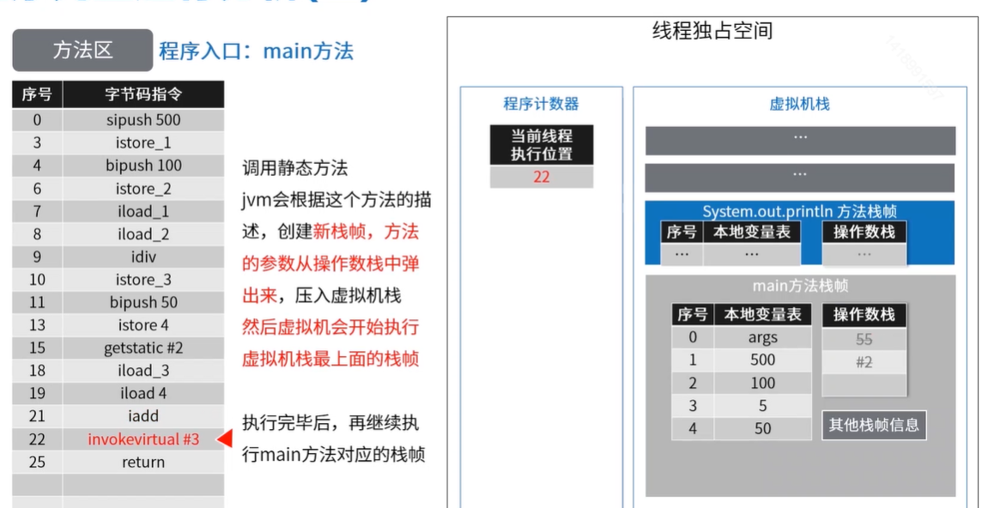

#### class文件内容

​         包含JAVA程序执行的`字节码`；数据严格按照格式紧凑排列在class文件中的`二进制流`，中间`无`任何`分隔符`；文件开头由一个0xcafebabe(16进制)特色的一个标志。

  

#### JVM运行时数据区


**线程独占**：每个线程都会由它独立的空间，随线程生命周期而创建和销毁。

**线程共享**：所有线程能访问这块内存数据，随虚拟机或GC而创建和销毁。

#### 方法区

​        JVM用来`存储加载的类信息，常量，静态变量，编译后的代码`等数据。虚拟机规范中这是一个逻辑区划。具体实现根据不同虚拟机来实现。如oracle的`HotSpot(虚拟机)`在java7中`方法区`放在`永久代`，java8放在`元数据空间`，并且通过`GC`集中对这个区域进行`管理`。

#### 堆内存


​        堆内存可以细分为：`老年代，新生代（Eden,From Survivor,To Survivor),`**`JVM启动时创建，存放对象和数组的实例`**。现代 VM 采用分代收集算法。`垃圾回收器`主要介绍`管理堆内存`。如果`满了`，就会出现`OutOfMemeroyError`。

#### 虚拟机栈

​        `每个线程`都在这个空间有`一个私有的空间`。线程栈由`多个栈帧`（Stack Frame)组成。

​         `一个线程会执行一个或者多个方法，一个方法对应一个栈帧`。

​         栈帧内容包含：**`局部变量表，操作数栈，动态连接，方法返回地址，附加信`**息等。

​         栈内存默认是`1M`，超出则抛出`StackOverflowError`。

#### 本地方法栈

​        和`虚拟栈功能类似`，`虚拟机栈`是`为虚拟机执行JAVA方法`而准备的，`本地方法`是`为虚拟机使用Native本地方法`而准备的。

​        虚拟机规范你没有规定具体的实现，由`不同的虚拟机`尝试`去实现`。

​        HotSot虚拟机中虚拟机栈和本地方法栈的实现是一样的，同样`超出大小`后则抛出StackOverflowError。

#### 程序计数器

​     ` 记录当前线程执行字节码的位置`，存储的是字节码指令地址，如果执行native方法，则计数器值为空。

​      每个线程都在这个空间有一个私有空间，占用内存很小。

​      CPU同一时间，只会执行一条线程中的指令。JVM`多线程`会`轮流切换`并`分配CPU执行时间`的方式。为了线程切换后，需要`通过程序计数器`，来恢`复正确`的执行`位置`。

#### 查看class文件内容

​      ` javap`是jdk自带的`反解析工具`。它的作用就是`根据class字节码文件`，`反解析`出当前类对应的`code区（汇编指令）、本地变量表、异常表和代码行偏移量映射表、常量池等等信息`。

​       java字节码信息查看工具:

​                            **java`编译成class`文件： ` javac 要编译的Java源文件`**

​                            **`查看class`文件内容  ： ` javap -v xxx.class >指定文件地址.txt`**

```java
public class Demo {
   public static void main(String[] args){
      int x = 500;
      int y = 100;
      int a = x/y;
      int b = 50;
      System.out.println(a+b);
   }
}
```

编译 ：  javac Demo.java

查看内容： javap -v Demo.class > Demo.txt

##### 版本号/访问控制

```java
public class Dex
      minor version: 0  //次版本号
      major version: 52  //主版本号 
      flags: ACC_PUBLIC, ACC_SUPER  //访问标志
```

`主版本号规则`：**JDK5，6，7，8**分别对应**49，50，51，52**

访问标志：

| 标志名称       | 标志值 | 含义                                                         |
| -------------- | ------ | ------------------------------------------------------------ |
| ACC_PUBLIC     | 0x0001 | 是否为public                                                 |
| ACC_FINAL      | 0x0010 | 是否被声明为final，只有类可设置                              |
| ACC_SUPER      | 0x0020 | 是否允许使用invokespecial字节码指令，JDK1.2之后编译出来的类的这个标志为true |
| ACC_INTERFACE  | 0x0200 | 标志这个是一个接口                                           |
| ACC_ABSTRACT   | 0x0400 | 是否为abstract类型，对于接口或抽象类来说，此标值为true，其他值为false |
| ACC_SYNTHETIC  | 0x1000 | 标志这个类并非由用户生产的                                   |
| ACC_ANNOTATION | 0x2000 | 标识这个是一个注解                                           |
| ACC_ENUM       | 0x4000 | 标识这是个枚举                                               |

##### 常量池Constant pool

```java
Constant pool:
   #1 = Methodref          #5.#14         // java/lang/Object."<init>":()V
   #2 = Fieldref           #15.#16        // java/lang/System.out:Ljava/io/PrintStream;
   #3 = Methodref          #17.#18        // java/io/PrintStream.println:(I)V
   #4 = Class              #19            // Dex
   #5 = Class              #20            // java/lang/Object
   #6 = Utf8               <init>
   #7 = Utf8               ()V
   #8 = Utf8               Code
   #9 = Utf8               LineNumberTable
  #10 = Utf8               main
  #11 = Utf8               ([Ljava/lang/String;)V
  #12 = Utf8               SourceFile
  #13 = Utf8               Dex.java
  #14 = NameAndType        #6:#7          // "<init>":()V
  #15 = Class              #21            // java/lang/System
  #16 = NameAndType        #22:#23        // out:Ljava/io/PrintStream;
  #17 = Class              #24            // java/io/PrintStream
  #18 = NameAndType        #25:#26        // println:(I)V
  #19 = Utf8               Dex
  #20 = Utf8               java/lang/Object
  #21 = Utf8               java/lang/System
  #22 = Utf8               out
  #23 = Utf8               Ljava/io/PrintStream;
  #24 = Utf8               java/io/PrintStream
  #25 = Utf8               println
  #26 = Utf8               (I)V
```

类信息包含的静态常量，编译后就确认：

| 标志名称                         | 含义                   |
| -------------------------------- | ---------------------- |
| CONSTANT_utf8_info               | UTF-8编码的字符串      |
| CONSTANT_Integer_info            | 整型字面量             |
| CONSTANT_Flaot_info              | 浮点型字面量           |
| CONSTANT_Long_info               | 长整型字面量           |
| CONSTANT_Double_info             | 双精度浮点型字面量     |
| CONSTANT_Class_info              | 类或接口的符号引用     |
| CONSTANT_String_info             | 字符串类型字面量       |
| CONSTANT_Fieldref_info           | 字段的符号引用         |
| CONSTANT_Methodref_info          | 类中方法的符号引用     |
| CONSTANT_InterfaceMethodref_info | 接口中方法的符号引用   |
| CONSTANT_NameAndType_info        | 字段或方法的符号引用   |
| CONSTANT_MothodTyoe_info         | 标志方法类型           |
| CONSTANT_MethodHandle_info       | 表示方法句柄           |
| CONSTANT_InvokeDynamic_info      | 表示一个动态方法调用点 |

##### 构造方法

```java
  public Dex();
    descriptor: ()V
    flags: ACC_PUBLIC
    Code:
      stack=1, locals=1, args_size=1
         0: aload_0
         1: invokespecial #1                  // Method java/lang/Object."<init>":()V
         4: return
      LineNumberTable:
        line 1: 0
```

Dex这个实例中我们没有写构造函数，可见，没有定义构造函数时，会有`隐式的无参构造函数`。


#### 程序完整运行的分析

​      1.**编译**，之后**加载到方法区**(类信息+运行时常量池字符串常量) HotSpot虚拟机(方法区)：jdk1.7之前叫永久代；1.8之后叫元数据空间。


​       2.`运行`，**jvm创建线程执行代码**，**在虚拟机栈和程序计数器中创建独立的线程**。


   分析运行过程：

​          线程独占空间，会在程序计数器上开辟一个小小的空间(每个线程)，用来**保存当前线程执行的代码的位**置，记录有序号的。

​         在虚拟机栈上开辟一个空间(每个线程)，一个线程就有一个栈，一**个栈是由多个栈帧**(方法操作)组成。栈帧中可能有**本地变量表和操作数栈**。它们相互操作以及记录来实现的。

​       调用静态方法jvm会根据这个方法的描述，**创建新栈帧**，方法的参数从操作数栈中弹出，压入虚拟机栈，然后虚拟机会开始执行虚拟机栈最上面的栈帧。  




